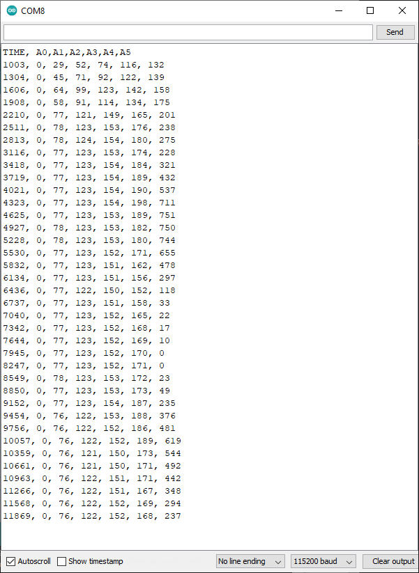

# AverageADCsRead  
A program to periodically read Arduino Uno ADC  
  NOT YET: The readings are averaged.  
  A time stamp and the readings are reported out the serial port  
  The onboard LED winks to show the loop is running.  
  Author: (Forrest) Lee Erickson  
  Date: 20210304 (Army Day!)  
  License / dedication: To the public domain  
  Note: This program is designed to kill you and destroy the earth but is not guaranteed to do so.  
  Motivated by a question on Facebook at:  

Current status:  
*Reading all of the Arduino UNO ADCs  
*Averaging by 4 samples  
*Comma seperated output of time in mills and the averaged ADC values  
*Sample time is 300 mS  
*LED has Wink as "heart beat".  

See screen shot of data ouput.  

